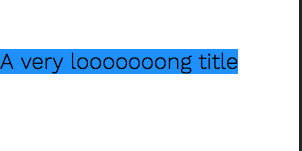

## ResponsiveText

A CSS-only technique for toggling the display between 2 strings based on CSS queries.

A typical use-case for this utility block is to show a lengthy title on large viewports, but show a shorter title when the viewport goes below a certain width.

